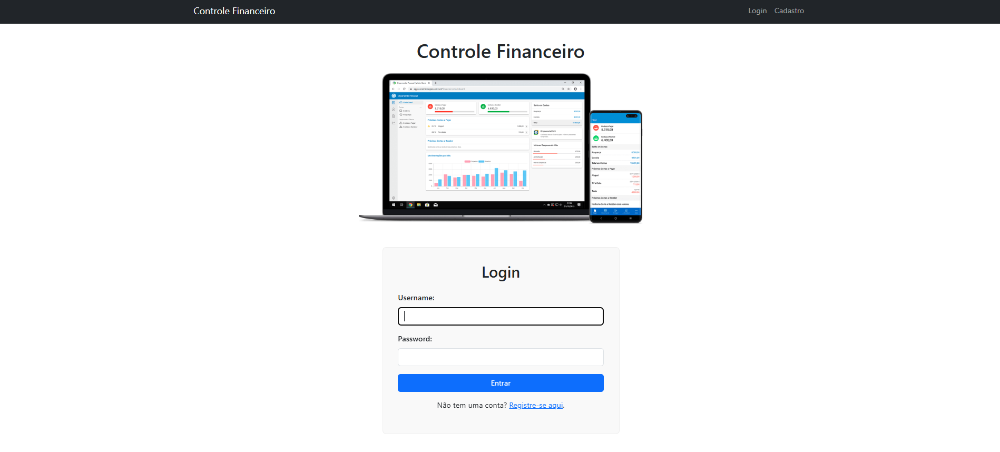
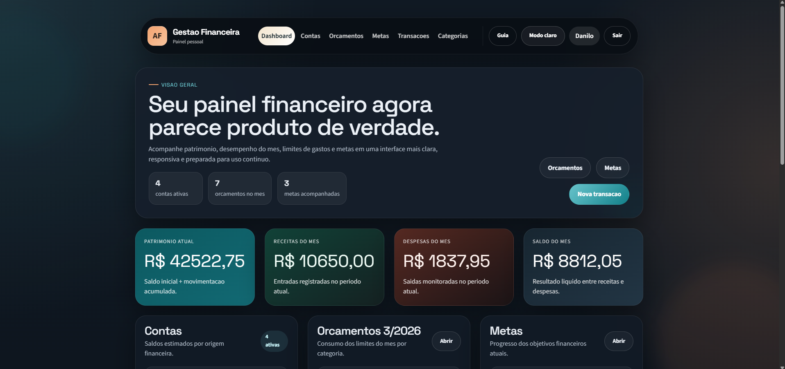
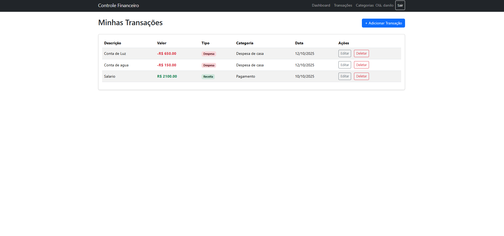
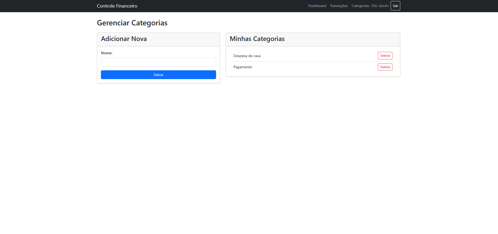

# 💰 Aplicativo de Controle Financeiro Pessoal (MVP)

Este é um **projeto acadêmico full-stack** desenvolvido com **Django** para controle financeiro pessoal.  
O objetivo é oferecer uma ferramenta **simples, segura e intuitiva** para gerenciar receitas e despesas, com foco total na **privacidade dos dados do usuário**.

---

## 🏛️ Contexto Acadêmico e Social

Este projeto foi desenvolvido como parte da disciplina **Programacao Orientada a Objetos**, do 4º semestre do curso de **Análise e Desenvolvimento de Sistemas** da **Universidade de Cuiabá**.

O sistema está alinhado ao **ODS 8 (Trabalho Decente e Crescimento Econômico)** da ONU, atuando como uma ferramenta de **alfabetização e empoderamento financeiro**.  
Ele busca apoiar **jovens trabalhadores e microempreendedores**, ajudando-os a tomar decisões baseadas em dados e alcançar maior estabilidade econômica.

---

## ✨ Funcionalidades Principais

- 🔐 **Autenticação Segura** — Registro, Login e Logout com criptografia nativa do Django.  
- 🧱 **Privacidade Total** — Cada usuário só acessa os próprios dados (arquitetura multi-tenant).  
- 📊 **Dashboard Dinâmico** — Exibe saldo atual, total de receitas e despesas.  
- 🗂️ **Gestão de Categorias** — CRUD completo de categorias personalizadas.  
- 💸 **Gestão de Transações** — CRUD completo de receitas e despesas.  
- 🧠 **Formulário Inteligente** — Mostra apenas categorias criadas pelo usuário logado.  
- 📱 **Interface Responsiva** — Desenvolvida com Bootstrap 5, adaptável a qualquer dispositivo.  

---

## 💻 Tecnologias Utilizadas

### **Back-End**
- **Python**
- **Django**
- **Django ORM**
- **SQLite** (para ambiente de desenvolvimento)

### **Front-End**
- **HTML5**
- **CSS3**
- **Bootstrap 5**
- **Django Template Language (DTL)**

### **Segurança**
- Sistema de autenticação nativo do Django  
- Proteção CSRF em todos os formulários  
- Filtragem de dados com `filter(usuario=request.user)` para isolamento completo  

---

## 🧭 Estrutura do Projeto

/controle_financeiro/  
│  
├── core/ # App principal (transações, categorias, views)  
├── users/ # App de autenticação e cadastro de usuários  
├── templates/ # HTMLs do Django Template Language  
├── static/ # Arquivos estáticos (CSS, JS, imagens)  
│ └── img/readme/ # Imagens utilizadas neste README  
├── db.sqlite3 # Banco de dados local  
├── manage.py # Gerenciador principal do Django  
└── requirements.txt # Dependências do projeto


---

## 1️⃣ Clonar o Repositório
```bash
git clone https://github.com/danilooliveira-lab/sistema_gestao_financeira
cd sistema_gestao_financeira ou o diretorio escolhido
```

### 2️⃣ Criar e Ativar o Ambiente Virtual (Venv)

Ativar no Windows
```bash
.\venv\Scripts\activate
```
Ativar no Mac/Linux
```bash
source venv/bin/activate
```
### 3️⃣ Instalar as Dependências
```bash
pip install -r requirements.txt
```
### 4️⃣ Aplicar as Migrações do Banco
```bash
python manage.py migrate
```
### 5️⃣ Criar um Superusuário (Admin)
```bash
python manage.py createsuperuser
```
### 6️⃣ Executar o Servidor
```bash
python manage.py runserver
```
### 7️⃣ Acessar o Sistema  
🌐 Aplicativo: http://127.0.0.1:8000/  

🔑 Painel Admin: http://127.0.0.1:8000/admin/  


  
## 🖼️ Prévia do Projeto

**Abaixo estão algumas capturas de tela do sistema em funcionamento:**

**🔐 Tela de Login**


**📊 Dashboard**


**💸 Aba de Transações**


**🗂️ Aba de Categorias**


## 🧑‍💻 Autores

👨‍🎓 **Danilo Oliveira**  - [danilooliveira-lab](https://www.github.com/danilooliveira-lab)  
👩‍🎓 **Marina Kleinschmitt**  - [marinakleinschmitt](https://www.github.com/marinakleinschmitt)  
👨‍🎓 **André Araújo** - [andreburro](https://www.github.com/andreburro)  

