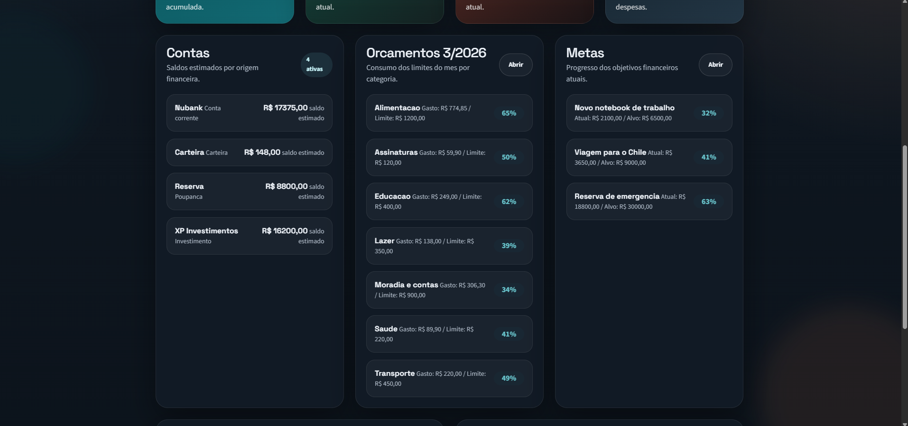
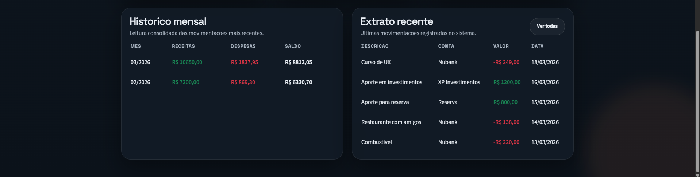
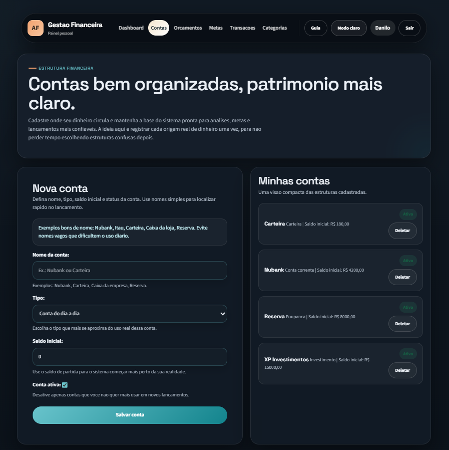
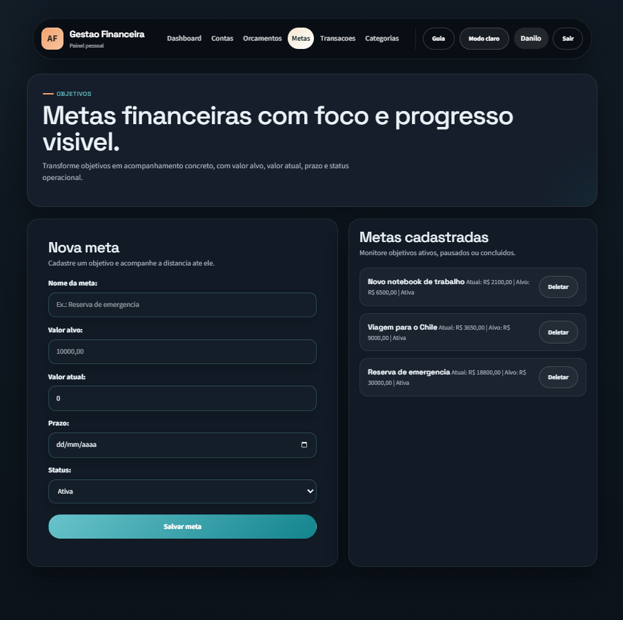
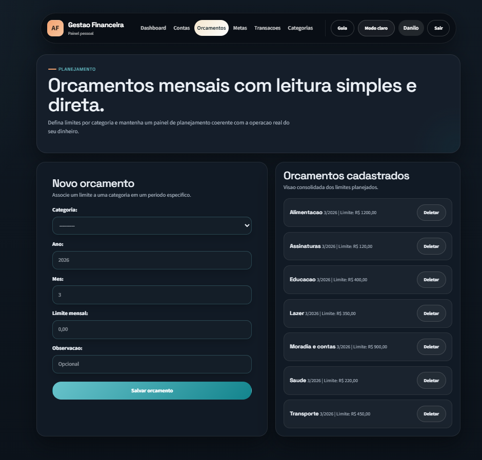

# Gestao Financeira

Sistema web de gestao financeira pessoal desenvolvido com Django. O projeto nasceu como trabalho academico e foi evoluido para uma base muito mais madura, com foco em organizacao financeira, experiencia do usuario e estrutura de codigo mais solida.

## Visao geral

O sistema permite registrar receitas e despesas, organizar contas e categorias, acompanhar patrimonio, definir orcamentos mensais e monitorar metas financeiras em uma interface moderna, responsiva e com tema claro/escuro.

Hoje o projeto vai muito alem de um CRUD basico e ja conta com:
- autenticacao completa
- perfil de usuario
- fluxo de recuperacao de senha
- dashboard consolidado
- contas, categorias, transacoes, metas e orcamentos
- selectors e services para separar melhor a logica
- cobertura inicial de testes

## Funcionalidades

### Autenticacao e usuario
- cadastro com nome, sobrenome, email, nome de usuario e senha
- login e logout
- perfil do usuario com edicao de dados
- recuperacao de senha no padrao do Django
- isolamento total dos dados por usuario

### Gestao financeira
- cadastro de contas financeiras
- categorias reutilizaveis
- lancamento de receitas e despesas
- criacao de categoria dentro do proprio formulario de transacao
- marcacao de transacoes recorrentes
- filtros por conta, tipo, recorrencia e busca textual

### Planejamento financeiro
- orcamentos mensais por categoria
- metas financeiras com valor alvo e progresso
- dashboard com patrimonio, receitas, despesas e saldo do mes
- historico consolidado e leitura mais clara dos dados

### Experiencia e interface
- layout repaginado
- responsividade
- tema claro e escuro
- formularios com mais contraste e legibilidade
- guia de uso separado para nao poluir a tela principal
- foco em reduzir atrito no primeiro uso

## Stack

### Back-end
- Python
- Django
- Django ORM
- SQLite em desenvolvimento

### Front-end
- HTML
- CSS
- Bootstrap 5
- Django Template Language

## Estrutura real do projeto

```text
sistema_gestao_financeira/
|-- config/
|   |-- settings.py
|   |-- urls.py
|   |-- wsgi.py
|   `-- asgi.py
|-- financeiro/
|   |-- forms.py
|   |-- models.py
|   |-- selectors.py
|   |-- services.py
|   |-- tests.py
|   |-- urls.py
|   `-- views.py
|-- static/
|   |-- css/
|   `-- img/
|-- templates/
|   |-- financeiro/
|   `-- registration/
|-- db.sqlite3
|-- manage.py
|-- requirements.txt
`-- README.md
```

## Evolucao do projeto

### Fase 1, base tecnica
- configuracao por ambiente com `.env`
- melhoria de seguranca inicial
- mensagens de erro e sucesso mais claras
- exclusoes protegidas por `POST`
- testes iniciais

### Fase 2, dominio financeiro
- introducao de `Conta`
- ampliacao da entidade `Transacao`
- mais contexto para movimentacoes
- dashboard com patrimonio e resumo por conta

### Fase 3, organizacao arquitetural
- consultas movidas para `selectors.py`
- operacoes movidas para `services.py`
- views mais enxutas
- filtros e paginacao mais bem estruturados

### Fase 4, planejamento
- orcamentos mensais
- metas financeiras
- historico e indicadores mais fortes no dashboard

### Fase 5, UX e apresentacao
- interface totalmente repaginada
- tema claro/escuro
- melhoria forte dos formularios
- onboarding menos poluido
- guia de uso
- perfil do usuario
- recuperacao de senha

## Capturas de tela

### Dashboard principal


### Dashboard com mais detalhes


### Historico no dashboard


### Gestao de contas


### Gestao de metas


### Gestao de orcamentos


## Como rodar localmente

### 1. Clonar o repositorio
```bash
git clone https://github.com/danilooliveira-lab/sistema_gestao_financeira
cd sistema_gestao_financeira
```

### 2. Criar e ativar o ambiente virtual
No Windows:
```bash
python -m venv .venv
.\.venv\Scripts\Activate.ps1
```

No Linux ou macOS:
```bash
python3 -m venv .venv
source .venv/bin/activate
```

### 3. Instalar dependencias
```bash
pip install -r requirements.txt
```

### 4. Configurar variaveis de ambiente
Crie um arquivo `.env` na raiz com algo como:

```env
DJANGO_SECRET_KEY=troque-esta-chave-em-producao
DJANGO_DEBUG=True
DJANGO_ALLOWED_HOSTS=127.0.0.1,localhost
DJANGO_TIME_ZONE=America/Sao_Paulo
DJANGO_EMAIL_BACKEND=django.core.mail.backends.console.EmailBackend
DJANGO_DEFAULT_FROM_EMAIL=gestao@localhost
```

### 5. Aplicar migracoes
```bash
python manage.py migrate
```

### 6. Rodar testes
```bash
python manage.py test
```

### 7. Subir o servidor
```bash
python manage.py runserver
```

Acesse:
- aplicacao: [http://127.0.0.1:8000/](http://127.0.0.1:8000/)
- admin Django: [http://127.0.0.1:8000/admin/](http://127.0.0.1:8000/admin/)

## Recuperacao de senha

O projeto ja possui fluxo de recuperacao de senha.

Em desenvolvimento:
- o backend de email pode usar console
- o link de redefinicao aparece no terminal do Django

Em ambiente real:
- basta configurar SMTP ou outro provedor de email
- o sistema passa a enviar o link por email de verdade

## Testes

Os testes atuais cobrem comportamentos como:
- autenticacao obrigatoria em rotas protegidas
- isolamento dos dados por usuario
- validacao de conta e categoria duplicadas
- filtros e paginacao de transacoes
- onboarding de categorias iniciais
- perfil e recuperacao de senha

## Pontos fortes do projeto
- base bem melhor organizada do que a versao inicial
- interface muito superior ao CRUD academico original
- separacao mais clara entre dominio, consultas e camada HTTP
- boa vitrine para portfolio academico
- base pronta para evoluir para algo ainda mais profissional

## Proximos passos possiveis
- importacao de extratos por CSV ou OFX
- automacao de recorrencias
- relatorios com graficos reais
- API REST
- deploy em nuvem
- alertas e notificacoes financeiras

## Autores
- Danilo Oliveira
- Marina Kleinschmitt
- Andre Araujo

## Licenca

Projeto academico e educacional.
